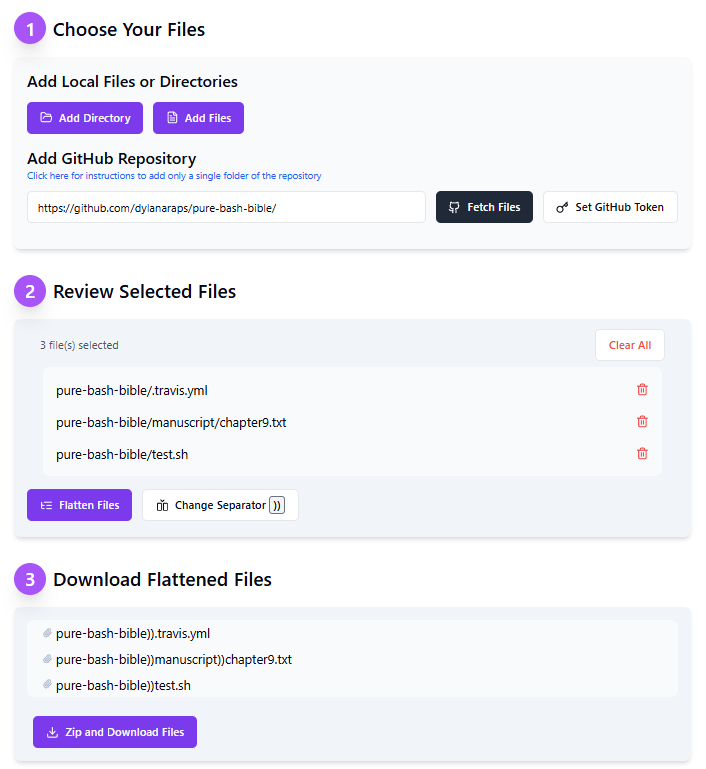

# One-Click Folder Flattener for Claude Projects and ChatGPT (And Anything Else!)

[](https://opensource.org/licenses/MIT)
[](https://reactjs.org/)
[](https://www.typescriptlang.org/)
[](https://tailwindcss.com/)

One-Click Folder Flattener is a dead simple client-side, private, web-based tool designed to simplify the process of recursively taking a directory and flattening all the files to a single folder without losing context. It was originally made to lessen the burden of having to navigate directories to add files to ChatGPT and Claude. It flattens your project file structure while preserving file relationships through prepending the directory location to the file name. Technically you have to select your files THEN it is one click. GitHub repositories can be pulled similarly in a single click with an optional access token. This project uses to ShadCN, Tailwind, Next.js and React to simplify other people's submissions.



## Table of Contents

- [One-Click Folder Flattener for Claude Projects and ChatGPT (And Anything Else!)](#one-click-folder-flattener-for-claude-projects-and-chatgpt-and-anything-else)
  - [Table of Contents](#table-of-contents)
  - [Features](#features)
  - [How It Works](#how-it-works)
  - [Installation](#installation)
  - [Usage](#usage)
  - [Configuration](#configuration)
    - [GitHub Token](#github-token)
  - [GitHub Integration and Privacy](#github-integration-and-privacy)
  - [Contributing](#contributing)
  - [Contact](#contact)
  - [Roadmap](#roadmap)

## Features

- **Local File and Directory Upload**: Add individual files or entire directories from your local machine.
- **GitHub Repository Integration**: Fetch files directly from a GitHub repository by providing the URL.
- **File Flattening**: Automatically flatten the file structure while preserving file relationships through naming conventions.
- **Preview and Edit**: Review selected files and remove any unwanted files before flattening.
- **Download**: Generate a zip file containing all flattened files for easy upload to Claude.ai.
- **Responsive Design**: Works seamlessly on desktop and mobile devices.

## How It Works

One-Click Folder Flattener processes your project structure, whether it's from local files/directories or a GitHub repository, and creates a flat structure where all files are in a single directory. The original file paths are placed into the new file names to preserve the structure information. The web app is single, static site executing client-side. All file and directory information stays local, including the ZIP process. You may optionally enter a GitHub token to avoid aggressive rate limiting.

> [!NOTE]
> GitHub rate limits unauthenticated API calls by IP address to 60/hour. If you add a token, you get 15,000 per account.  Check the [GitHub Integration and Privacy](#github-integration-and-privacy) section for more info.

Here's an example of how the flattening process works for an added directory:

```
Original Structure:
myproject/
├── src/
│   ├── components/
│   │   ├── Header.tsx
│   │   └── Footer.tsx
│   ├── pages/
│   │   ├── index.tsx
│   │   └── about.tsx
│   └── styles/
│       └── main.css
└── README.md

Flattened Structure:
myproject::src_components::Header.tsx
myproject::src_components::Footer.tsx
[...]
myproject::README.md
```

Here's an example of how the flattening process works for a github repo (https://github.com/f/awesome-chatgpt-prompts in this case):

```
Original Structure:
awesome-chatgpt-prompts/
├── .github/
│   ├── FUNDING.yml/
│   ├── contentcodex.png
...

Flattened Structure:
awesome-chatgpt-prompts::.github::FUNDING.yml
awesome-chatgpt-prompts::.github::contentcodex.png
...
```

Key points about the flattening process:

1. **Directories and Git Repositories**: The relative path is added to the filename, with directory separators replaced by slashes. This preserves the project structure information.

2. **Individual Files**: When a single file is uploaded (not part of a directory or repository), it retains its original filename without any path information. This is a browser security consideration, to avoid exposing potentially sensitive information about the user's file system structure.

3. **GitHub Repositories**: Files from GitHub repositories are treated similarly to local directories. The repository name and relative path within the repository are included in the flattened filename.

This flattening process applies identically to both local files/directories and files fetched from GitHub repositories. The tool ensures that the original file structure can be inferred from the new file names, allowing Claude.ai to understand the context and relationships between files, while maintaining user privacy and security.

The flattening process involves these steps:

1. **File Selection**: Users can add files through local upload or by providing a GitHub repository URL.
2. **Path Analysis**: The tool analyzes the file structure, determining relative paths for directories and repositories.
3. **Renaming**: Files are renamed to include their original path information, with special handling for individual file uploads.
4. **Zip Creation**: Flattened files are packaged into a zip file in a single directory so when you "add content" to your Claude project, you can just shift+click to select all the files.

## Installation

To set up the File Flattener locally, follow these steps:

```bash
# Clone the repository
git clone https://github.com/shacthulu/one-click-folder-flattener.git

# Navigate to the project directory
cd one-click-folder-flattener

# Install dependencies
npm install

# Start the development server
npm run dev
```

## Usage

1. **Adding Files**:
   - Click "Add Files" to select individual files from your computer
   - Click "Add Directory" to select an entire folder
   - Enter a GitHub repository URL and click "Fetch Files" to import from GitHub

2. **GitHub Integration**:
   - (Optional) Set or update your GitHub Personal Access Token for private repositories
   - Enter the full GitHub repository URL, including any subdirectory path

3. **File Management**:
   - Review the list of selected files
   - Remove any files you don't want to include

4. **Flattening**:
   - Click "Flatten Files" to process the selected files
   - Review the new flattened file structure

5. **Downloading**:
   - Click "Download Flattened Files" to get a zip file of the processed files

6. **Using with Claude.ai**:
   - Upload the downloaded zip file to Claude.ai's project files feature
   - You can now reference these files in your conversations with Claude, maintaining context about their original structure

## Configuration

### GitHub Token

To use the GitHub integration feature:

1. Generate a Personal Access Token on GitHub with `repo` scope.
2. In the File Flattener interface, click "Set GitHub Token" and enter your token.

## GitHub Integration and Privacy

The File Flattener for Claude Projects offers GitHub integration to allow users to easily fetch and flatten files from GitHub repositories. Here's what you need to know about using this feature:

1. **GitHub Token**: 
   - You can use the application without a GitHub token, but you'll be subject to GitHub's API rate limits for unauthenticated requests.
   - For better performance and access to private repositories, you can provide a GitHub Personal Access Token.

2. **Token Scopes**:
   - For public repositories only: Use a token with the `public_repo` scope.
   - For both public and private repositories: Use a token with the `repo` scope.

3. **Generating a Token**:
   - Go to GitHub Settings > Developer settings > Personal access tokens
   - Click "Generate new token" and select the appropriate scopes
   - Copy the generated token (you won't be able to see it again)

4. **Token Storage and Privacy**:
   - Your GitHub token is stored only in your browser's local storage.
   - The token is never sent to our servers or any third-party services.
   - You can remove the token at any time by clicking "Update Token" and clearing the input.

5. **Application Privacy**:
   - The entire File Flattener application runs locally in your browser.
   - No data is sent to external servers (except for GitHub API requests when using the GitHub integration).
   - Your files and directory structures are processed entirely on your local machine.

6. **Security Considerations**:
   - Always be cautious when granting access to your GitHub account.
   - Use tokens with the minimum necessary permissions for your use case.
   - Regularly rotate your GitHub tokens as a security best practice.

By using a GitHub token, you can avoid rate limiting issues and access private repositories if needed. Remember that the File Flattener is designed with privacy in mind, processing everything locally and never sharing your data or tokens with external services. GitHub's limitations are as follows:

Unauthenticated (i.e. no token) calls are:
- 60 per hour per IP

Authenticated calls are:
- 15,000 per hour per account
- <= 100 concurrent requests
- 900 requests per minute for REST API

## Contributing

We welcome contributions to the One-Click Folder Flattener project! Please follow these steps:

1. Fork the repository
2. Create a new branch: `git checkout -b feature/your-feature-name`
3. Make your changes and commit them: `git commit -m 'Add some feature'`
4. Push to the branch: `git push origin feature/your-feature-name`
5. Submit a pull request

Please read [CONTRIBUTING.md](CONTRIBUTING.md) for details on our code of conduct and the process for submitting pull requests.

## Contact

Project Link: [https://github.com/shacthulu/one-click-folder-flattener](https://github.com/shacthulu/one-click-folder-flattener)

If you have any questions or feedback, please open an issue on GitHub or contact the maintainers directly.

## Roadmap

- [x] Directory upload
- [x] Singular file upload
- [x] Delete individual files option
- [x] Auto file rename
- [x] Add GitHub integration
- [x] Allow personal access token
- [x] Clean up web interface
- [x] Add README and CONTRIBUTING docs
- [ ] Finish switching name from "directory-flattener" to "one-click-folder-flattener"
- [x] Add recursive file count and confirmation for GitHub repos
- [x] Add token storage options
- [x] Add GitHub token creation walkthrough
- [x] Make page responsive
- [x] Make page accessible
- [ ] Add keyboard navigation
- [ ] Add repo subdirectory exclusion before transfer to reduce API calls
- [ ] Add "advanced" option panel
- [ ] Add Thanks section to README
- [ ] Fix ugly UI
- [ ] Refactor DirectoryFlattener
- [ ] Add github Oauth option for token connection
- [ ] Add pre-transfer folder and file exclusion for GitHub
- [ ] Add pre-transfer folder and file exclusion for local source
- [ ] Add support for 3rd-party file stores (Google Drive, OneDrive, etc)
- [ ] Add support for non-GitHub repos
- [ ] Add support for websites
- [ ] Allow users to change or remove the directory delimiter
- [ ] Allow users to add text metadata to file list or files
- [ ] Allow users to manually change file names
- [ ] Allow users to add a manual prefix
- [ ] Retool the selection/removal pane to make it easier to exclude entire directories, file types, etc and also use a selection so you can easily switch it up
- [ ] Add a visual indicator (optionally) for files that aren't accepted by Claude,
- [ ] Add a visual indicator for file size and/or token size
- [ ] Add automatic junk and unimportant file removal option

> [!NOTE]
> We want to keep this as simple as possible for the 99% of users so advanced options will need to be easily accessible, yet tucked away. We want your grandma to have this in her bookmarks.

---

Made with ❤️ by [ShaCthulu]
